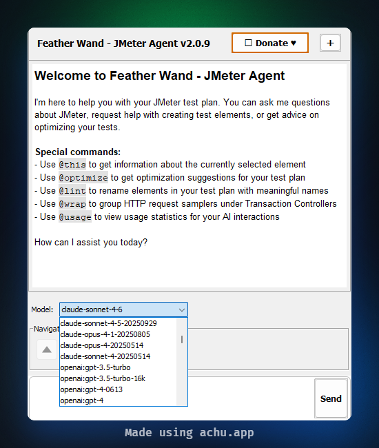
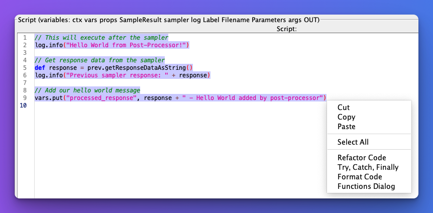

# 🚀 Feather Wand - JMeter Agent

This plugin provides a simple way to chat with AI in JMeter. Feather Wand serves as your intelligent assistant for
JMeter test plan development, optimization, and troubleshooting.

> 🪄 **About the name**: The name "Feather Wand" was suggested by my children who were inspired by an episode of the
> animated show Bluey. In the episode, a simple feather becomes a magical wand that transforms the ordinary into
> something
> special (heavy) - much like how this plugin aims to transform your JMeter experience with a touch of AI magic!




## ✨ Features

- Chat with AI directly within JMeter using Claude, OpenAI, or Ollama models
- **New!** **Multi-AI CLI Terminal**: run **Claude Code**, **OpenAI Codex CLI**, **Gemini CLI**, or **OpenCode**
  interactively within JMeter — switch between available CLIs via a dropdown selector, with full awareness of your
  current test plan structure.
- **New!** **Streaming AI responses**: AI responses appear token-by-token in real-time (supports Claude, OpenAI, and
  Ollama)
- **New!** **Stop button**: Cancel an ongoing AI response at any time with the Stop button
- **New!** **Response chime**: Audio notification when AI responses complete (configurable)
- Get suggestions for JMeter elements based on your needs
- Ask questions about JMeter functionality and best practices
- Command intellisense with auto-completion for special commands in the chat input box
- Use `@this` command to get detailed information about the currently selected element
- Use `@code` command to extract code blocks from AI responses into the JSR223 editor
- Use `@usage` command to get usage examples for JMeter components
- Use `@lint` command to automatically rename elements in your test plan for better organization and readability
- Use `@optimize` command to get optimization recommendations for the currently selected element in your test plan
- Use `@wrap` command to intelligently group HTTP samplers under Transaction Controllers for better organization and
  reporting
- Use right click context menu to refactor code, format code, and add functions in JSR223 script editor
- Customize AI behavior through configuration properties
- Switch between Claude, OpenAI, and Ollama models based on your preference or specific needs

## 📥 Installation

### Plugins Manager (Recommended)

1. Install the JMeter Plugins Manager from [Plugins Manager](https://jmeter-plugins.org/).
2. Restart JMeter.
3. Launch Plugins Manager.
4. Search for `feather wand` under `Available Plugins` tab.
5. Select it and click `Apply Changes and Restart JMeter` button.

### Manual Installation (Alternative)

1. Download the latest release JAR file from the [Releases](https://github.com/QAInsights/jmeter-ai/releases) page.
2. Place the JAR file in the `lib/ext` directory of your JMeter installation.
3. Copy the contents of `jmeter-ai-sample.properties` into your `jmeter.properties` file (located in the `bin` directory
   of your JMeter installation) or into your `user.properties` file.
4. Configure your API key(s) for Anthropic and/or OpenAI in the properties file.
5. Restart JMeter.
6. The Feather Wand plugin will appear as a new component in the right-click menu under "Add" > "Non-Test Elements" > "
   Feather Wand".

## ⚙️ Configuration

The Feather Wand plugin can be configured through JMeter properties. Copy the `jmeter-ai-sample.properties` file content
to your `jmeter.properties` or `user.properties` file and modify the properties as needed.

### 🔧 Available Configuration Options

#### Streaming Configuration

| Property                      | Description                                                         | Default Value |
|-------------------------------|---------------------------------------------------------------------|---------------|
| `jmeter.ai.streaming.enabled` | Enable real-time streaming of AI responses (token-by-token display) | `true`        |
| `jmeter.ai.response.chime`    | Play an audio chime when AI responses complete                     | `false`       |

> When streaming is enabled (default), AI responses appear progressively in the chat as they are generated. You can
> cancel the response at any time using the **Stop** button that appears next to the Send button. This feature is
> supported by **all three** AI services: Claude, OpenAI, and Ollama. If you prefer to receive the complete response at
> once (non-streaming), set `jmeter.ai.streaming.enabled=false`.

#### Anthropic (Claude) Configuration

| Property                  | Description                                                  | Default Value              |
|---------------------------|--------------------------------------------------------------|----------------------------|
| `anthropic.api.key`       | Your Claude API key                                          | Required                   |
| `claude.default.model`    | Default Claude model to use                                  | claude-sonnet-4-6          |
| `claude.temperature`      | Temperature setting (0.0-1.0)                                | 0.5                        |
| `claude.max.tokens`       | Maximum tokens for AI responses                              | 1024                       |
| `claude.max.history.size` | Maximum conversation history size                            | 10                         |
| `claude.system.prompt`    | System prompt that guides Claude's responses                 | See sample properties file |
| `anthropic.log.level`     | Logging level for Anthropic API requests ("info" or "debug") | Empty (disabled)           |

#### OpenAI Configuration

| Property                  | Description                                               | Default Value              |
|---------------------------|-----------------------------------------------------------|----------------------------|
| `openai.api.key`          | Your OpenAI API key                                       | Required                   |
| `openai.default.model`    | Default OpenAI model to use                               | gpt-4o                     |
| `openai.temperature`      | Temperature setting (0.0-1.0)                             | 0.5                        |
| `openai.max.tokens`       | Maximum tokens for AI responses                           | 1024                       |
| `openai.max.history.size` | Maximum conversation history size                         | 10                         |
| `openai.system.prompt`    | System prompt that guides OpenAI's responses              | See sample properties file |
| `openai.log.level`        | Logging level for OpenAI API requests ("INFO" or "DEBUG") | Empty (disabled)           |

#### Ollama Configuration

| Property                         | Description                                                    | Default Value              |
|----------------------------------|----------------------------------------------------------------|----------------------------|
| `ollama.host`                    | Ollama server host                                             | `http://localhost`         |
| `ollama.port`                    | Ollama server port                                             | `11434`                    |
| `ollama.default.model`           | Default Ollama model to use                                    | `deepseek-r1:1.5b`         |
| `ollama.temperature`             | Temperature setting (0.0-1.0)                                  | `0.5`                      |
| `ollama.max.history.size`        | Maximum conversation history size                              | `10`                       |
| `ollama.thinking.mode`           | Enable extended thinking (`ENABLED` or `DISABLED`)             | `DISABLED`                 |
| `ollama.thinking.level`          | Thinking depth (`LOW`, `MEDIUM`, or `HIGH`)                    | `MEDIUM`                   |
| `ollama.request.timeout.seconds` | HTTP request timeout in seconds (increase for thinking models) | `120`                      |
| `ollama.system.prompt`           | System prompt that guides Ollama's responses                   | See sample properties file |

> ⚠️ When `ollama.thinking.mode=ENABLED`, increase `ollama.request.timeout.seconds` to at least `300` to avoid timeout
> errors during long inference.

#### Code Refactoring Configuration

| Property                        | Description                                                          | Default Value |
|---------------------------------|----------------------------------------------------------------------|---------------|
| `jmeter.ai.refactoring.enabled` | Enable code refactoring for JSR223 script editor                     | true          |
| `jmeter.ai.service.type`        | The AI service to use for code refactoring ("openai" or "anthropic") | "openai"      |

#### AI CLI Terminal Configuration

The AI CLI Terminal supports **Claude Code**, **OpenAI Codex CLI**, **Gemini CLI**, and **OpenCode**. The plugin
automatically detects which CLIs are available on your system's `PATH` and presents them in a dropdown selector.

**Prerequisites:**

| CLI                    | Binary Name | Installation Guide                                                        |
|------------------------|-------------|---------------------------------------------------------------------------|
| **Claude Code**        | `claude`    | [Claude Code Quickstart](https://docs.anthropic.com/en/docs/claude-code)  |
| **OpenAI Codex CLI**   | `codex`     | [OpenAI Codex CLI](https://github.com/openai/codex)                       |
| **Google Gemini CLI**  | `gemini`    | [Google Gemini CLI](https://cloud.google.com/vertex-ai/generative-ai/docs/command-line) |
| **OpenCode**           | `opencode`  | [OpenCode](https://github.com/sst/opencode)                                |

| Property                                | Description                                                                                | Default Value              |
|-----------------------------------------|--------------------------------------------------------------------------------------------|----------------------------|
| `jmeter.ai.terminal.claudecode.enabled` | Enable the embedded AI CLI Terminal feature (applies to all supported CLIs)                | true                       |
| `jmeter.ai.terminal.claudecode.path`    | Full path to the `claude` executable (e.g., `/usr/local/bin/claude` or `C:\...`)            | Empty (auto-detect)        |
| `jmeter.ai.terminal.claudecode.prompt`  | Custom system prompt passed to the CLI (not recommended to change)                         | See sample properties file |

### 💬 Customizing the System Prompt

The system prompt defines how the AI (Claude or OpenAI) responds to your queries. You can customize this in the
properties file to focus on specific aspects of JMeter or add your own guidelines.

`claude.system.prompt`, `openai.system.prompt`, and `ollama.system.prompt` can be configured separately in the
properties file. The default prompts are designed to provide helpful, JMeter-specific responses tailored to each AI
model's capabilities.

## 🔍 Special Commands

### 📊 @usage Command

Use the `@usage` command to view detailed token usage information for your AI interactions:

1. **How to Use**:

    - Simply type `@usage` in the chat
    - The command will show usage statistics for either OpenAI or Anthropic depending on which service you're using

2. **Information Provided**:

    - Overall summary of total conversations and tokens used
    - Detailed breakdown of recent conversations (last 10)
    - Token usage per conversation (input and output tokens)
    - Timestamps and model information
    - Link to official pricing pages for cost information

3. **Example Output**:

   ``
   # Usage Summary

   ## Overall Summary
    - Total Conversations: 5
    - Total Input Tokens: 1500
    - Total Output Tokens: 2000
    - Total Tokens: 3500

   ## Recent Conversations
    - Conversation 1: 300 input, 400 output tokens
    - Conversation 2: 250 input, 350 output tokens
      ...
      ``

4. **Benefits**:
    - Track your API usage and costs
    - Monitor token consumption patterns
    - Identify potential optimization opportunities
    - Keep track of conversation history

### 🪄 @this Command

Use the `@this` command in your message to get detailed information about the currently selected element in your test
plan. For example:

- "Tell me about @this element"
- "How can I optimize @this?"
- "What are the best practices for @this?"

Feather Wand will analyze the selected element and provide tailored information and advice.

### 🔧 @optimize Command

Use the `@optimize` command (or simply type "optimize") to get optimization recommendations for the currently selected
element in your test plan. This command will:

1. Analyze the selected element's configuration
2. Identify potential performance bottlenecks
3. Suggest specific, actionable improvements
4. Provide best practices for that element type

For example, if you have an HTTP Request sampler selected, the optimization recommendations might include:

- Connection and timeout settings adjustments
- Proper header management
- Efficient parameter handling
- Encoding settings optimization
- Redirect handling improvements

Simply select an element in your test plan and type `@optimize` or `optimize` in the chat to receive tailored
optimization recommendations.

### 🧹 @lint Command

Use the `@lint` command to automatically rename elements in your test plan for better organization and readability:

1. **How to Use**:

    - Type `@lint` in the chat to analyze your test plan structure
    - The AI will suggest better names for elements based on their function and context
    - Review the suggestions and confirm to apply the changes
    - Use the undo/redo buttons to revert or reapply changes if needed
    - e.g. `@lint rename the elements based on the URL` or `@lint rename the elements in pascal case`

2. **Benefits**:

    - Improves test plan readability and maintenance
    - Applies consistent naming conventions across your test plan
    - Helps identify elements with generic or unclear names
    - Makes test plans more understandable for team members
    - Undo it if you don't like the changes
    - Redo it if you like the changes

3. **Best Practices**:
    - Run `@lint` after creating a new test plan to establish good naming from the start
    - Use it before sharing test plans with team members
    - Apply it to imported test plans to make them conform to your naming standards

This feature is particularly valuable for large test plans or when working in teams where consistent naming is essential
for collaboration.

### 📦 @wrap Command

Use the `@wrap` command to intelligently group HTTP samplers under Transaction Controllers for better organization and
reporting:

1. **How to Use**:

    - Select a Thread Group in your test plan
    - Type `@wrap` in the chat
    - The AI will analyze your HTTP samplers and group similar ones under Transaction Controllers
    - Use the undo button to revert changes if needed

2. **Benefits**:

    - Improves test plan organization and readability
    - Enhances test reports with meaningful transaction metrics
    - Groups related HTTP requests logically
    - Preserves the original order and hierarchy of samplers
    - Maintains all child elements (like assertions and post-processors) with their parent samplers

3. **How It Works**:
    - Analyzes sampler names and paths to identify logical groupings
    - Creates appropriately named Transaction Controllers
    - Moves samplers under their respective Transaction Controllers
    - Preserves the original order and hierarchy
    - Uses pattern matching and structural analysis (not AI) for its grouping logic

This feature is especially useful for imported or recorded test plans that contain many individual HTTP samplers without
proper organization.

## 💨 Streaming AI Responses

Feather Wand supports **real-time streaming** of AI responses across all three supported AI services (Claude, OpenAI,
and Ollama). This feature is enabled by default and provides a more responsive chat experience.

### How It Works

1. When you send a message, the AI response begins to appear **token-by-token** in the chat area in real-time
2. A **Stop** button appears next to the Send button while the response is being generated
3. You can click **Stop** at any time to cancel the response mid-stream
4. The response is automatically saved to the conversation history once complete

### Controls

| Control         | Description                                                     |
|-----------------|-----------------------------------------------------------------|
| **Stop** button | Appears during streaming — click to cancel the current response |

### Configuration

Streaming is enabled by default. To disable it, set the following in your properties file:

```properties
jmeter.ai.streaming.enabled=false
```

When disabled, AI responses will appear all at once after the entire response has been generated (non-streaming mode).

### Benefits

- **Faster perceived response time**: You see the response as it's being generated rather than waiting for it to
  complete
- **Early feedback**: If the response isn't what you expected, you can stop it early without waiting for it to finish
- **Improved UX**: Provides a more interactive and responsive chat experience

## 🔔 Response Chime

Feather Wand can play an audio chime when AI responses complete, giving you an audible cue so you can work in other
windows and know exactly when the AI has finished responding.

### How It Works

1. When an AI response (streaming or non-streaming) completes, a WAV chime sound plays.
2. The chime plays after the full response is displayed in the chat area.
3. If the sound resource cannot be loaded, it falls back to the system beep.

### Configuration

The response chime is **disabled by default**. To enable it, add the following to your properties file:

```properties
jmeter.ai.response.chime=true
```

| Property                   | Description                                  | Default Value |
|----------------------------|----------------------------------------------|---------------|
| `jmeter.ai.response.chime` | Play an audio chime when AI responses finish | `false`       |

### Sound File

The chime uses the WAV file bundled at `src/main/resources/org/qainsights/jmeter/ai/sound/jmeter-chime.wav`.
An MP3 fallback is also included at the same location.

## 💻 Multi-AI CLI Terminal

Feather Wand features a fully embedded interactive **AI CLI Terminal** using JediTerm. This allows you to interact
with multiple AI command-line tools directly from within JMeter, bringing agentic AI workflows into your performance
testing environment.

### Supported CLIs

| CLI                    | Description                                                                  |
|------------------------|------------------------------------------------------------------------------|
| **Claude Code**        | Anthropic's agentic coding tool for natural language test plan interaction   |
| **OpenAI Codex CLI**   | OpenAI's lightweight coding agent for terminal-based development workflows   |
| **Google Gemini CLI**  | Google's AI-powered CLI for cloud development and analysis                   |
| **OpenCode**           | An open-source AI coding agent designed for terminal-based workflows         |

The plugin **automatically detects** which of these CLIs are available on your system's `PATH` and presents them
in a dropdown selector within the terminal header. Simply select the CLI you'd like to use and start interacting.

### How It Works

1. **Prerequisites**: Install one or more supported CLIs on your system (see the [Configuration](#-configuration)
   section for installation links).
2. **Auto-detection**: Feather Wand scans your system's `PATH` on startup and populates the dropdown with
detected CLIs.
3. **CLI Selector**: Use the dropdown in the terminal header to switch between available CLIs at any time.
   Switching will automatically restart the terminal with the newly selected CLI.
4. **Setup**: Make sure to set `jmeter.ai.terminal.claudecode.enabled=true` in your properties file.
5. **Capabilities**:
    - Start, reload, and interact with the JMeter test plan using natural language.
    - The selected CLI automatically receives the full structure/context of the currently open `.jmx` file via a
      `CLAUDE.md` file written to the test plan directory.
    - You can ask the CLI to run the test plan, parse JTL files, and more.
    - Use the **Reload** button to refresh the test plan from disk.
    - Use the **Ctx** button to send the test plan context again.
6. **Disabling**: If you do not want to use this feature, set `jmeter.ai.terminal.claudecode.enabled=false`. The
   terminal widget will gracefully start a dummy process with an instructional message.

### Extensibility (Adapter Pattern)

The AI CLI Terminal is built using a clean **Adapter Pattern**:

- `AiCliAdapter` interface — defines the contract for any AI CLI integration
- `BaseCliAdapter` abstract class — provides common logic (e.g., PATH detection via `findOnPath`)
- Concrete adapters — `ClaudeCodeCliAdapter`, `OpenAiCodexCliAdapter`, `GeminiCliAdapter`, `OpenCodeCliAdapter`

To add a new CLI, simply implement the `AiCliAdapter` interface (or extend `BaseCliAdapter`) and register it in
the `detectAvailableClis()` method.

**⚠️ Disclaimer**: AI CLIs are powerful tools that can execute commands, modify files, and consume API tokens
significantly faster than standard chat interfaces. Users are strongly encouraged to thoroughly review the official
documentation of each CLI to fully understand their capabilities, security considerations, and potential costs
before enabling and using this feature.

## 🗝️ API Configuration

Feather Wand supports Anthropic (Claude), OpenAI, and Ollama APIs. You can configure any combination in your properties
file.

### Anthropic API (Claude)

1. Go to [Anthropic API](https://www.anthropic.com/) website
2. Sign up for an account
3. Create a new API key
4. Copy the API key and paste it into the `anthropic.api.key` property in your `jmeter.properties` file
5. For more information about the API key, visit the [API Key documentation](https://www.anthropic.com/api)

### OpenAI API

1. Go to [OpenAI API](https://platform.openai.com/) website
2. Sign up for an account
3. Create a new API key
4. Copy the API key and paste it into the `openai.api.key` property in your `jmeter.properties` file
5. For more information about the API key, visit
   the [API Key documentation](https://platform.openai.com/docs/api-reference)

### Ollama (Local)

1. Install Ollama from [ollama.com](https://ollama.com/)
2. Pull a model, e.g. `ollama pull llama3.1` or `ollama pull deepseek-r1:1.5b`
3. Set `jmeter.ai.service.type=ollama` in your `jmeter.properties` file
4. Configure `ollama.host`, `ollama.port`, and `ollama.default.model` as needed
5. No API key required - Ollama runs fully locally

### Model Selection

Feather Wand automatically filters available models to show only chat-compatible models. By default, it excludes audio,
TTS, transcription, and other non-chat models. You can select your preferred model from the dropdown in the UI, or set
default models in the properties file:

- For Claude: `claude.default.model` (e.g., `claude-sonnet-4-6`)
- For OpenAI: `openai.default.model` (e.g., `gpt-4o`)
- For Ollama: `ollama.default.model` (e.g., `llama3.1`, `deepseek-r1:1.5b`)

### Model Filtering

Feather Wand applies intelligent filtering to the available models to ensure you only see relevant chat models in the
dropdown:

- **OpenAI Models**: Filters out audio, TTS, whisper, davinci, search, transcribe, realtime, and instruct models to show
  only GPT chat models.
- **Claude Models**: Shows only the latest available Claude models.

This filtering ensures that you only see models that are compatible with the chat interface and appropriate for
JMeter-related tasks.

## 🪲 Report Issues

If you encounter any issues or have suggestions for improvement, please open an issue on
the [GitHub repository](https://github.com/qainsights/jmeter-ai).

## ⛳️ Roadmap

Please check the [roadmap](https://github.com/users/QAInsights/projects/12) for more details.

## ⚠️ Disclaimer and Best Practices

While the Feather Wand plugin aims to provide helpful assistance, please keep the following in mind:

- **AI Limitations**: The AI can make mistakes or provide incorrect information. Always verify critical suggestions
  before implementing them in production tests.
- **Backup Your Test Plans**: Always backup your test plans before making significant changes, especially when
  implementing AI suggestions.
- **Test Verification**: After making changes based on AI recommendations, thoroughly verify your test plan
  functionality in a controlled environment before running it against production systems.
- **Performance Impact**: Some AI-suggested configurations may impact test performance. Monitor resource usage when
  implementing new configurations.
- **Security Considerations**: Do not share sensitive information (credentials, proprietary code, etc.) in your
  conversations with the AI.
- **API Costs**: Be aware that using the Claude API or OpenAI API incurs costs based on token usage. The plugin is
  designed to minimize token usage, but excessive use may result in higher costs.

This plugin is provided as a tool to assist JMeter users, but the ultimate responsibility for test plan design,
implementation, and execution remains with the user.