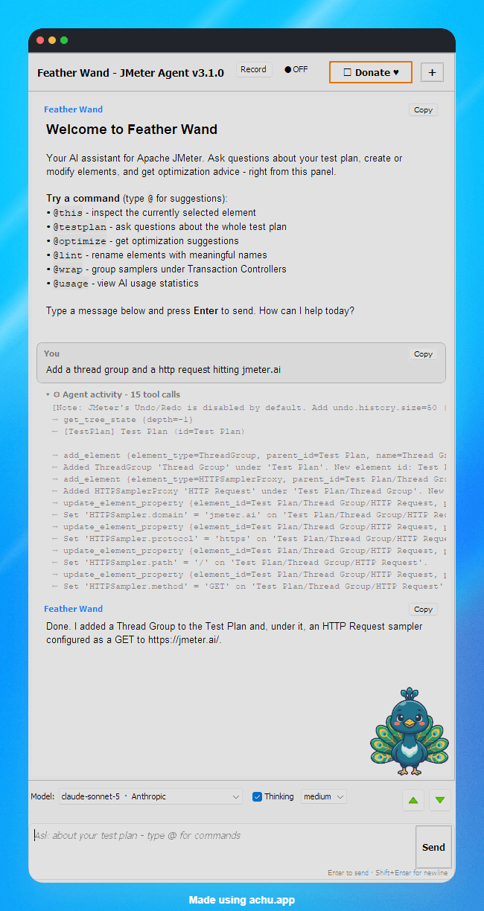
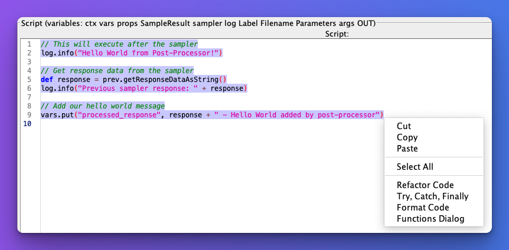
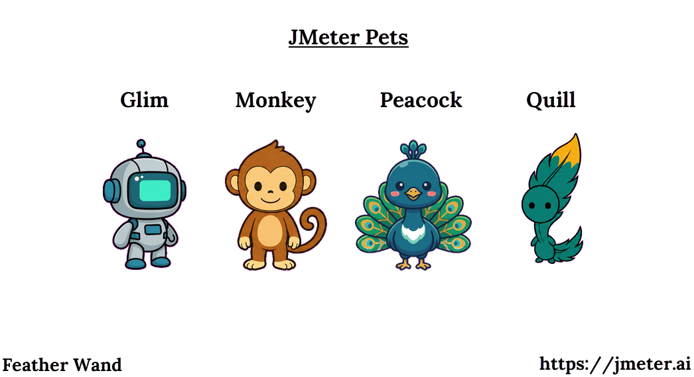

<div align="center">

# 🪶 Feather Wand

**AI-powered assistant for Apache JMeter**

[](https://github.com/QAInsights/jmeter-ai/releases)
[](https://plugins.jmeter.ai/plugin/feather-wand-jmeter-ai-agent/)
[](LICENSE)
[](https://github.com/QAInsights/jmeter-ai)

[Features](#-features) · [Install](#-installation) · [Configure](#-configuration) · [Commands](#-special-commands) · [Changelog](https://github.com/QAInsights/jmeter-ai/releases)

</div>

> 🪄 **Why "Feather Wand"?** My kids named it after a *Bluey* episode, where a simple feather becomes a magical wand that turns the ordinary into something special. That's exactly what this plugin does for your JMeter workflow.

<div align="center">



</div>

---

## 📑 Contents

- [Features](#-features)
- [Installation](#-installation)
- [Configuration](#-configuration)
- [Special Commands](#-special-commands)
- [Agent Mode](#-agent-mode)
- [Streaming](#-streaming-ai-responses)
- [File Attachments](#-file-attachments)
- [Conversation Persistence & Export](#-conversation-persistence--export)
- [Response Chime](#-response-chime)
- [Pets](#-pets)
- [AI CLI Terminal](#-multi-ai-cli-terminal)
- [API Setup](#-api-configuration)
- [Roadmap & Issues](#-report-issues)
- [Disclaimer](#-disclaimer-and-best-practices)

---

## ✨ Features

| | |
|:---|:---|
| 🤖 **Multi-Model Chat** | Talk to Claude, OpenAI, Google Gemini, DeepSeek, Ollama, Grok (xAI), Meta Muse, or compatible AWS Bedrock models, all inside JMeter. |
| ⚡ **Real-Time Streaming** | Watch AI responses appear token-by-token with a **Stop** button to cancel anytime. |
| 🖥️ **AI CLI Terminal** | Run **Claude Code**, **OpenAI Codex**, **OpenCode**, **Antigravity**, or **Grok CLI** directly in JMeter. |
| 🧹 **Smart Refactoring** | Right-click in the JSR223 editor to refactor, format, or inject functions with AI. |
| 🔍 **Context-Aware Commands** | `@this`, `@testplan`, `@optimize`, `@lint`, `@wrap`, `@code`, `@usage`, each tailored to your test plan. |
| 🔔 **Audio Chime** | Optional sound notification when AI finishes responding. |
| 🐾 **Companion Pet** | A draggable animated pet that reacts to your test runs: cheers on success, frowns on failures. Pick from quill, glim, peacock, or monkey. |
| 🤖 **Agent Mode** | AI autonomously edits your test plan (add elements, set properties, run tests, correlate dynamic values) through 18 tools. **Claude & OpenAI.** |
| 🔧 **Model Filtering** | Only chat-compatible models appear in the dropdown, no audio/TTS clutter. |
| ⚙️ **Fully Configurable** | Customize prompts, temperature, tokens, history, timeouts, and more via JMeter properties. |
| 🧠 **Thinking & Effort** | Per-model **Thinking** checkbox and effort dropdown in the toolbar; reasoning streams into a collapsible *Thoughts* card in the transcript. |
| 📎 **File Attachments** | Attach `jmeter.log`, results (`.jtl`/`.csv`), or any text file via the paperclip, drag-drop, or paste. Smart digests (percentiles, error breakdowns) instead of raw dumps - on every provider. |
| 💾 **Conversation Persistence** | Chats autosave to `~/.jmeter-ai/sessions/` and can be restored after a JMeter restart. Export any conversation to Markdown or HTML for your test reports. |

---

## 📥 Installation

### Plugins Manager *(Recommended)*

```text
1. Install JMeter Plugins Manager → https://jmeter-plugins.org/
2. Restart JMeter
3. Open Plugins Manager → Available Plugins
4. Search for "feather wand"
5. Select it → Apply Changes and Restart JMeter
```

### Manual Installation

```text
1. Download the latest JAR from Releases
2. Drop it into JMeter's lib/ext directory
3. Copy jmeter-ai-sample.properties into jmeter.properties (or user.properties)
4. Add your API key(s) and restart JMeter
```

See [Releases](https://github.com/QAInsights/jmeter-ai/releases) for the latest JAR.

## ⚙️ Configuration

Copy `jmeter-ai-sample.properties` into your `jmeter.properties` or `user.properties` and adjust the values below.

### General Settings

| Property | Description | Default |
|----------|-------------|---------|
| `jmeter.ai.streaming.enabled` | Stream AI responses token-by-token | `true` |
| `jmeter.ai.response.chime` | Play a chime when AI finishes | `false` |
| `jmeter.ai.refactoring.enabled` | Enable JSR223 editor AI refactoring | `true` |
| `jmeter.ai.service.type` | Default AI service for refactoring | `anthropic` |

### AI Service Settings

<details>
<summary><b>Anthropic (Claude)</b></summary>

| Property | Description | Default |
|----------|-------------|---------|
| `anthropic.api.key` | Claude API key | **Required** |
| `claude.default.model` | Default model | `claude-sonnet-4-6` |
| `claude.temperature` | Temperature (0.0-1.0) | `0.5` |
| `claude.max.tokens` | Max response tokens | `1024` |
| `claude.max.history.size` | Conversation history size | `10` |
| `claude.system.prompt` | System prompt | See sample file |
| `anthropic.log.level` | Logging (`info`/`debug`) | *(empty)* |

</details>

<details>
<summary><b>OpenAI</b></summary>

| Property | Description | Default |
|----------|-------------|---------|
| `openai.api.key` | OpenAI API key | **Required** |
| `openai.default.model` | Default model | `gpt-4o` |
| `openai.temperature` | Temperature (0.0-1.0) | `0.5` |
| `openai.max.tokens` | Max response tokens | `1024` |
| `openai.max.history.size` | Conversation history size | `10` |
| `openai.system.prompt` | System prompt | See sample file |
| `openai.log.level` | Logging (`INFO`/`DEBUG`) | *(empty)* |

</details>

<details>
<summary><b>Google Gemini</b></summary>

| Property | Description | Default |
|----------|-------------|---------|
| `google.api.key` | Google AI API key | **Required** |
| `google.default.model` | Default model | `gemini-2.5-flash` |
| `google.temperature` | Temperature (0.0-1.0) | `0.7` |
| `google.max.tokens` | Max response tokens | `4096` |
| `google.max.history.size` | Conversation history size | `10` |
| `google.system.prompt` | System prompt | See sample file |

</details>

<details>
<summary><b>Ollama (Local)</b></summary>

| Property | Description | Default |
|----------|-------------|---------|
| `ollama.host` | Server host | `http://localhost` |
| `ollama.port` | Server port | `11434` |
| `ollama.default.model` | Default model | `deepseek-r1:1.5b` |
| `ollama.temperature` | Temperature (0.0-1.0) | `0.5` |
| `ollama.max.history.size` | Conversation history size | `10` |
| `ollama.thinking.mode` | Extended thinking (`ENABLED`/`DISABLED`) | `DISABLED` |
| `ollama.thinking.level` | Thinking depth (`LOW`/`MEDIUM`/`HIGH`) | `MEDIUM` |
| `ollama.request.timeout.seconds` | Request timeout | `120` |
| `ollama.system.prompt` | System prompt | See sample file |

> ⚠️ If `ollama.thinking.mode=ENABLED`, raise `ollama.request.timeout.seconds` to at least `300`.

</details>

<details>
<summary><b>Grok (xAI)</b></summary>

| Property | Description | Default |
|----------|-------------|---------|
| `grok.api.key` | xAI API key | **Required** |
| `grok.default.model` | Default model | `grok-4.5` |
| `grok.temperature` | Temperature (0.0-1.0) | `0.7` |
| `grok.max.tokens` | Max response tokens | `4096` |
| `grok.max.history.size` | Conversation history size | `10` |
| `grok.system.prompt` | System prompt | See sample file |

</details>

<details>
<summary><b>Meta Muse</b></summary>

| Property | Description | Default |
|----------|-------------|---------|
| `meta.api.key` | Meta AI API key | **Required** |
| `meta.base.url` | Base URL endpoint | `https://api.meta.ai/v1` |
| `meta.default.model` | Default model | `muse-spark-1.1` |
| `meta.temperature` | Temperature (0.0-1.0) | `0.7` |
| `meta.max.tokens` | Max response tokens | `4096` |
| `meta.max.history.size` | Conversation history size | `10` |
| `meta.system.prompt` | System prompt | See sample file |

</details>

<details>
<summary><b>AWS Bedrock</b></summary>

Feather Wand uses Bedrock's standardized **Converse** and **ConverseStream** APIs for chat requests. This provides one request and streaming format across compatible Anthropic, Meta, Mistral, MiniMax, Amazon, and other Bedrock text-generation models instead of requiring a provider-specific payload formatter.

| Property | Description | Default |
|----------|-------------|---------|
| `bedrock.api.key` | Bedrock API key (bearer token) | *(empty)* |
| `bedrock.aws.access.key` | IAM access key; used when no Bedrock API key is set | *(empty)* |
| `bedrock.aws.secret.key` | IAM secret key | *(empty)* |
| `bedrock.aws.region` | AWS Region used for discovery and inference | `us-east-1` |
| `bedrock.default.model` | Default Bedrock model ID | `anthropic.claude-3-5-sonnet-20241022-v2:0` |
| `bedrock.model.providers` | Comma-separated provider filter | `Anthropic` |
| `bedrock.temperature` | Temperature | `0.5` |
| `bedrock.max.tokens` | Maximum response tokens | `4096` |
| `bedrock.max.history.size` | Conversation history size | `10` |
| `bedrock.system.prompt` | System prompt | See sample file |

**Authentication priority:** Bedrock API key, IAM access key and secret key, then the AWS default credential chain. Do not commit credentials to a properties file or source repository.

**Model discovery:** The selector includes active, text-capable foundation models and active system-defined inference profiles matching `bedrock.model.providers`. Inference profiles are checked for agreement, authorization, entitlement, and regional availability before they are shown. Models such as image, embedding, reranking, and speech models are excluded from the chat selector.

**Anthropic access:** Anthropic models may require the Bedrock First-Time Use form, AWS Marketplace permissions, a valid payment method, and an active model agreement. If `get-foundation-model-availability` reports `agreementAvailability=NOT_AVAILABLE`, the model can be visible in AWS discovery but cannot be invoked by the account yet.

**Compatibility:** Chat models must support Bedrock Converse/ConverseStream. Models that only provide embeddings, image generation, audio, video, or other non-chat capabilities require a separate feature flow and cannot be used in this chat panel.

Restart JMeter after changing Bedrock properties or installing a new plugin JAR.

See the [Bedrock Converse API documentation](https://docs.aws.amazon.com/bedrock/latest/userguide/conversation-inference.html) and [model access documentation](https://docs.aws.amazon.com/bedrock/latest/userguide/model-access.html) for account setup and model availability details.

</details>

### AI CLI Terminal

| Property | Description | Default |
|----------|-------------|---------|
| `jmeter.ai.terminal.claudecode.enabled` | Enable the embedded terminal | `true` |
| `jmeter.ai.terminal.claudecode.path` | Full path to `claude` binary | *(auto-detect)* |
| `jmeter.ai.terminal.copilot.enabled` | Enable GitHub Copilot CLI | `false` |
| `jmeter.ai.terminal.copilot.path` | Full path to `copilot` binary | *(auto-detect)* |
| `jmeter.ai.terminal.antigravity.enabled` | Enable Antigravity CLI | `false` |
| `jmeter.ai.terminal.grok.enabled` | Enable Grok CLI | `false` |
| `jmeter.ai.terminal.font.family` | Terminal font family (e.g. `Consolas`, `Noto Sans Mono CJK SC`) | *(auto-detect)* |
| `jmeter.ai.terminal.font.size` | Terminal font size | `16.0` |
| `jmeter.ai.terminal.font.cjk.fallback` | Fall back to a CJK-capable font when the selected font cannot display CJK | `true` |

#### Terminal font & CJK support

The terminal uses the font family you configure. If `jmeter.ai.terminal.font.cjk.fallback=true` and the selected font cannot display CJK characters, the plugin automatically picks the best CJK-capable font installed on your system (`NSimSun`, `SimSun`, `MS Gothic`, `Microsoft YaHei`, `Malgun Gothic`, etc.).

| Use case | Recommended configuration |
|----------|---------------------------|
| English / Latin only; keep your Western monospaced font | `jmeter.ai.terminal.font.family=Consolas`<br>`jmeter.ai.terminal.font.size=16.0`<br>`jmeter.ai.terminal.font.cjk.fallback=false` |
| CJK support; let the plugin pick the best available font | `jmeter.ai.terminal.font.size=16.0`<br>`jmeter.ai.terminal.font.cjk.fallback=true` |
| CJK support with a specific installed font | `jmeter.ai.terminal.font.family=Noto Sans Mono CJK SC`<br>`jmeter.ai.terminal.font.size=16.0`<br>`jmeter.ai.terminal.font.cjk.fallback=false` |

> ⚠️ When `cjk.fallback=true` with a non-CJK font like `Consolas`, the configured family is overridden because `Consolas` has no CJK glyphs. If you want to force `Consolas`, set `cjk.fallback=false`; CJK will then render as boxes.

**Prerequisite CLIs**

| CLI | Binary | Install Guide |
|-----|--------|---------------|
| Claude Code | `claude` | [Docs](https://docs.anthropic.com/en/docs/claude-code) |
| OpenAI Codex | `codex` | [Repo](https://github.com/openai/codex) |
| GitHub Copilot | `copilot` | [Docs](https://docs.github.com/en/copilot/how-tos/copilot-cli/cli-getting-started) |
| OpenCode | `opencode` | [Repo](https://github.com/sst/opencode) |
| Antigravity | `agy` | [Site](https://www.antigravity.google/product/antigravity-cli) |
| Grok CLI | `grok` | [Console](https://console.x.ai/) |

### Custom System Prompts

Each service supports its own `*.system.prompt` property; tweak them in your properties file to focus the AI on specific JMeter topics or team conventions.

## 🔍 Special Commands

Type any of these directly in the chat box. All commands are context-aware and work with the currently selected test-plan element.

| Command | What it does | Example |
|---------|--------------|---------|
| `@this` | Describe the selected element and suggest best practices. | `How do I configure @this?` |
| `@testplan` | Send the entire test plan tree context to the AI (e.g. to find all target URLs). | `@testplan which URL is under test?` |
| `@optimize` | Analyze the selected element and suggest performance tweaks. | `@optimize` or `optimize this sampler` |
| `@lint` | Auto-rename elements for consistency. Undo/redo supported. | `@lint rename elements in PascalCase` |
| `@wrap` | Group HTTP samplers under Transaction Controllers. | `@wrap` *(select a Thread Group first)* |
| `@code` | Extract the last AI code block into the JSR223 editor. | `@code` |
| `@usage` | Show token-usage stats and recent conversation history. | `@usage` |

### `@lint` Tips
- Run it after importing a recorded test plan to clean up generic names.
- Use it before sharing plans with your team.
- Apply custom rules: `@lint rename based on the URL`.

### `@wrap` Details
`@wrap` uses pattern matching (not AI) to group related HTTP samplers under Transaction Controllers, preserving child elements and hierarchy. Great for imported or recorded plans.

## 🤖 Agent Mode

Agent Mode lets the AI **autonomously edit your live JMeter test plan** through a tool-calling loop. Instead of just chatting about what you should do, the agent reads the tree, reasons about needed changes, calls tools to mutate elements, verifies the results, and iterates until the task is done, all inside the existing chat panel.

> ⚠️ **Claude & OpenAI only.** Agent Mode currently works with **Anthropic Claude** and **OpenAI** models. Gemini, DeepSeek, Ollama, Grok, and Bedrock are not supported; they fall back to plain chat. Support for additional providers is planned.

<div align="center">



</div>

### Enabling Agent Mode

Agent Mode is **off by default**. To turn it on:

```properties
# In user.properties or jmeter.properties
jmeter.ai.agent.enabled=true
```

Select a **Claude** or **OpenAI** model from the dropdown. Then just type your request naturally in the chat box; if Agent Mode is enabled and a supported model is selected, the agent loop activates automatically.

> If a model from any other provider is selected, the request is handled by the regular (non-agentic) chat path.

Both providers get the exact same tools, system prompt, safety gates and iteration limits; only the wire format differs (Anthropic `tool_use` blocks vs. OpenAI function `tool_calls`).

> 💡 **OpenAI note**: temperature is left at the model default for agent runs, so reasoning models (`o1`, `o3`, `o4`, `gpt-5`) work without extra configuration. `jmeter.ai.agent.max.tokens` maps to `max_completion_tokens`. For **gpt-5.1 and later** (`gpt-5.6-terra`, `gpt-5.6-sol`, ...) the agent automatically sends `reasoning_effort=none`, because those models reject function tools on `/v1/chat/completions` while reasoning is on, so tool calling works out of the box.

> 💡 **Thinking in Agent Mode (Claude)**: when the Thinking checkbox is on, each agent turn's reasoning accumulates in a collapsed **Thoughts** card next to the tool-activity group. Agent loops pay the thinking budget on *every* iteration — keep the effort at `medium`, or pin an agent-only level with `jmeter.ai.agent.thinking.effort` (empty = follows the toolbar).

### Claude vs. OpenAI: How the Adapters Differ

Both providers are driven through the exact same provider-neutral `ChatModel` seam (`start`/`next`) and share one `JsonSchemaMapper`, so every tool looks byte-identical to both; only the wire format differs:

| Aspect | Anthropic Claude (`anthropic-java`) | OpenAI (`openai-java`) |
|--------|--------------------------------------|--------------------------|
| Tool definition | `Tool` (native tool schema) | `ChatCompletionFunctionTool` (function-type only; non-function "custom" tool calls are ignored) |
| System prompt | Top-level `system` string, separate from `messages` | A message inside the rolling `messages` list |
| Message roles | `user` / `assistant` only (tool outcomes ride back as a `user` turn of `tool_result` content blocks) | `system` / `user` / `assistant` / **`tool`** |
| Tool-call arguments | Already a `JsonValue` → converted to a `Map` directly | A JSON **string** → parsed with Jackson (tolerates malformed JSON) |
| Tool-result error signaling | Native `is_error` boolean | No native error flag; errors are conveyed via an `ERROR [...]` prefix in the content |
| Model-specific quirks | None needed | `reasoning_effort=none` forced for gpt-5.1+ (else tool calls 400); temperature never sent (o1/o3/o4/gpt-5 reject non-default values) |

### Provider Support Roadmap

Feather Wand already talks to more providers than Agent Mode currently supports; most of the gap is *wiring*, not feasibility, since several already share Claude's or OpenAI's SDK under the hood:

| Provider | Already in Feather Wand? | Tool-calling on the wire? | Adapter effort |
|----------|---------------------------|----------------------------|-----------------|
| **Anthropic Claude** | ✅ Agent Mode | Native `tool_use` | Done |
| **OpenAI** | ✅ Agent Mode | Native `tool_calls` | Done |
| **DeepSeek** | Plain chat only | Yes: OpenAI-compatible `tools`/`tool_choice` (or Anthropic-compatible via `/anthropic`) | 🟢 Trivial (already uses `openai-java`/`anthropic-java` pointed at `api.deepseek.com`) |
| **Grok (xAI)** | Plain chat only | Yes: OpenAI-style function tools | 🟢 Trivial (already uses `openai-java` pointed at `api.x.ai`) |
| **Meta "Muse"** | Plain chat only | Likely yes (OpenAI-compatible endpoint) | 🟢 Trivial, pending confirmation (already uses `openai-java` pointed at `api.meta.ai`) |
| **Kimi K2/K3 (Moonshot AI)** | Not yet added | Yes: standard OpenAI-shaped `tools`/`tool_calls` | 🟢 Trivial (same "point `openai-java` at a new base URL" pattern) |
| **Poolside (Laguna models)** | Not yet added | Yes: OpenAI-compatible `tools`/`tool_choice` at `inference.poolside.ai` (also via OpenRouter/Bedrock) | 🟢 Trivial (same pattern) |
| **Mistral AI** | Not yet added | Yes: native function-calling, OpenAI-similar shape | 🟢 Trivial (same pattern) |
| **Alibaba Qwen** | Not yet added | Yes: OpenAI-compatible DashScope endpoint | 🟢 Trivial (same pattern) |
| **Zhipu GLM** | Not yet added | Yes: OpenAI-compatible tool calling | 🟢 Trivial (same pattern) |
| **Google Gemini** | Plain chat only | Yes: `FunctionDeclaration`/`Tool` via the official `google-genai` SDK | 🟡 Medium (new adapter mapping `ToolSpec` → `FunctionDeclaration` and function-call parts → `AssistantTurn`). **Next up.** |
| **Ollama (local)** | Plain chat only | Yes: `ollama4j` has native `Tools.Tool` registration for tool-capable local models (Llama 3.1+, Qwen, Mistral, ...) | 🟡 Medium (new adapter; also gated by which local model is pulled) |
| **AWS Bedrock** | Plain chat only | Yes: the `Converse`/`ConverseStream` API's `toolConfig` is provider-agnostic across every model family Bedrock hosts (Anthropic, Meta Llama, Mistral, Amazon Nova, Cohere, AI21) | 🟡 Medium, high leverage (one `BedrockToolAdapter` unlocks tool-calling for every Bedrock-hosted model at once) |
| **Cohere (Command R+)** | Not yet added | Yes, but its own (non-OpenAI-shaped) tool-use API | 🔴 Bespoke adapter needed |

### Agent Settings

| Property | Description | Default |
|----------|-------------|---------|
| `jmeter.ai.agent.enabled` | Enable agent tool-calling loop | `false` |
| `jmeter.ai.agent.max.tokens` | Max tokens per agent response | `4096` |
| `jmeter.ai.agent.max.iterations` | Max reason-act iterations per request | `8` |
| `jmeter.ai.agent.confirm.destructive` | Show confirmation dialog before destructive ops | `true` |

> 💡 **Undo support**: JMeter's Undo/Redo is disabled by default (`undo.history.size=0`). Add `undo.history.size=50` to `user.properties` and restart JMeter so you can Ctrl+Z agent-made changes. The agent will remind you once if it's off.

### Available Tools

The agent has 18 tools at its disposal:

**Read**

| Tool | What it does |
|------|--------------|
| `get_tree_state` | Returns the full test-plan tree with element names, types, and enabled state. |
| `get_element_config` | Returns all properties of a specific element. |
| `get_element_children` | Returns the children of a specific element. |
| `get_element_schema` | Returns the property schema and allowed values for an element type. |

**Write**

| Tool | What it does |
|------|--------------|
| `add_element` | Adds a new element (e.g. `HTTPSamplerProxy`) as a child of a parent element. |
| `update_element_property` | Sets a scalar property (e.g. `HTTPSampler.path`) on an element. |
| `set_property_list` | Sets a flat string-list property (e.g. `ResponseAssertion` test patterns). |
| `set_structured_property_list` | Sets a structured list (e.g. `HeaderManager.headers`, `Arguments.arguments`, `AuthManager.auth_list`). |
| `delete_element` | Deletes an element and its subtree. **Confirmation gated.** |
| `toggle_element` | Enables or disables an element (disabled elements are skipped at run time). |
| `move_element` | Reparents an element to become the last child of a new parent. **Confirmation gated.** |
| `duplicate_element` | Deep-clones an element's subtree as the next sibling. |
| `rename_element` | Renames an element (non-destructive; reports the new tree-path id). |
| `reorder_element` | Repositions an element among its current siblings by index. |

**Run**

| Tool | What it does |
|------|--------------|
| `run_test` | Starts the test plan (same as JMeter's Start button). |
| `stop_test` | Stops the running test (`force=true` for immediate shutdown). |
| `get_test_results` | Runs the plan in a private engine, blocks until completion or timeout, and reports pass/fail counts with failure details. |

**Correlation**

| Tool | What it does |
|------|--------------|
| `find_correlation_candidates` | Probes the test plan (1 thread/1 loop) and detects dynamic values that need correlation. |
| `apply_correlation` | Applies selected correlation candidates: adds extractors and rewrites matching values to `${variable}`. **Confirmation gated.** |

**File**

| Tool | What it does |
|------|--------------|
| `save_plan` | Saves the test plan to a `.jmx` file. |
| `open_plan` | Opens a `.jmx` file, replacing the current plan. **Confirmation gated.** |

### How It Works

1. You type a request in the chat box (e.g. *"Add an HTTP Request under the Thread Group and set its path to /login"*)
2. The agent reads the current tree state via `get_tree_state`
3. It calls `add_element` to create the HTTP Request sampler
4. It calls `update_element_property` to set the path
5. It calls `get_element_config` to verify the change
6. It responds with a natural-language summary

Each tool call and result is streamed to the chat in real time, so you can follow along. The agent's final answer is replayed token-by-token (gated by `jmeter.ai.streaming.enabled`).

### Safety

- **Destructive operations** (`delete_element`, `move_element`, `open_plan`, `apply_correlation`) show a **Yes/No confirmation dialog** before executing. Disable with `jmeter.ai.agent.confirm.destructive=false`.
- **Bounded iterations**: The agent stops after `jmeter.ai.agent.max.iterations` (default 8) even if the task isn't complete.
- **Graceful degradation**: If the agent loop fails (API error, malformed response, etc.), it falls back to a plain-text answer describing what it attempted.
- **Undo**: All agent mutations fire the same JMeter tree-model events as GUI actions, so they're undoable with Ctrl+Z when `undo.history.size > 0`.

### Examples

Try these in the chat box with Agent Mode enabled and a Claude or OpenAI model selected:

| Request | What the agent does |
|---------|-------------------|
| *Add an HTTP Request under the Thread Group and set its path to /login* | `get_tree_state` → `add_element` → `update_element_property` → `get_element_config` |
| *Disable the second HTTP Request* | `get_tree_state` → `toggle_element` |
| *Add a Response Assertion that checks for 200* | `get_tree_state` → `add_element` → `set_property_list` |
| *Move the JSON Extractor under the first HTTP Request* | `get_tree_state` → `move_element` (asks confirmation) |
| *Run the test and tell me if it passed* | `run_test` → `get_test_results` |
| *Find dynamic values that need correlation* | `find_correlation_candidates` |
| *Apply correlation for candidates 1 and 3* | `apply_correlation` (asks confirmation) |
| *Save the test plan to /tmp/my-plan.jmx* | `save_plan` |

### Dev Menu Items

For isolated manual testing, Feather Wand adds dev menu items under **Run → AI Dev:** that exercise individual tools against the selected tree node without going through the agent loop. These are intended for development and debugging:

- **AI Dev: Test add_element**: prompt for type/name, add under selected node
- **AI Dev: Test update_element_property**: prompt for property/value, update selected node
- **AI Dev: Test delete_element**: confirm, delete selected node
- **AI Dev: Test toggle_element**: prompt for true/false, toggle selected node
- **AI Dev: Test move_element**: prompt for destination parent id, move selected node

## 💨 Streaming AI Responses

All configured AI services that support streaming provide real-time responses. AWS Bedrock uses the ConverseStream API for compatible chat models. Responses appear token-by-token as they are generated.

| Control | What it does |
|---------|--------------|
| **Stop** | Appears next to the Send button during streaming; click to cancel mid-response. |

**Disable streaming:**

```properties
jmeter.ai.streaming.enabled=false
```

## 🧠 Thinking & Effort

Next to the model selector, a **Thinking** checkbox and an **effort** dropdown appear automatically when the selected model supports them - models with no reasoning support (e.g. `gpt-4o`) hide both. Reasoning streams into a collapsible **Thoughts** card above the answer, in both plain chat and Agent Mode.

Effort levels shown in the dropdown come straight from the vendored per-model data (models.dev), so newer levels like `xhigh`/`max` appear automatically where supported.

| Model family | Thinking checkbox | Effort levels | Notes |
|---|---|---|---|
| Claude 4.x (Anthropic, Bedrock) | yes | low / medium / high / max | Thinking budget per level (property-overridable); temperature is dropped and `max_tokens` auto-bumped when thinking is on |
| Claude 5 (fable) | yes | low / medium / high / xhigh / max | Adaptive thinking + `output_config` effort; summarized thoughts shown in the Thoughts card |
| OpenAI o1 / o3 / o4 | always on | low / medium / high | `reasoning_effort` |
| OpenAI gpt-5* | always on | minimal / low / medium / high | `reasoning_effort` |
| OpenAI gpt-5.x | yes (off -> `none`) | none / low / medium / high | Agent Mode still forces `none` (chat-completions rejects tools + effort) |
| Gemini 2.5 Flash | yes | low / medium / high | `thinkingBudget`; unchecked sends budget 0 (thinking disabled) |
| Gemini 2.5 Pro | always on | low / medium / high | `thinkingBudget` (Pro cannot disable thinking) |
| Gemini 3 | always on | low / high | `thinkingLevel` |
| Ollama (thinking models) | yes | low / medium / high | Capability probed live via `/api/show`; UI overrides `ollama.thinking.*` properties |
| Grok 4.5 | always on | low / medium / high | `reasoning_effort` (cannot be disabled); summarized reasoning shown in the Thoughts card |
| Meta Muse Spark | always on | minimal / low / medium / high / xhigh | `reasoning_effort` via the Responses API with `reasoning.summary`; summary shown in the Thoughts card (verbosity via `meta.reasoning.summary=auto\|concise\|detailed`, default `auto`) |
| Bedrock: Claude | yes | low / medium / high / max (+ xhigh on newer) | Thinking JSON in `additionalModelRequestFields` (budget or adaptive) |
| Bedrock: Nova 2 Lite | yes | low / medium / high | `reasoningConfig.maxReasoningEffort`; off by default; `high` drops temperature per AWS requirement |
| Bedrock: OpenAI (gpt-oss, gpt-5.x) | gpt-5.x only | low / medium / high (+ none / xhigh / max on gpt-5.x) | `reasoning_effort` (snake_case) |
| Bedrock: others (deepseek, qwen, glm, kimi, ...) | always on | - | No params sent; reasoning shown in the Thoughts card when streamed |
| DeepSeek reasoner | always on | - | Reasoning is shown in the Thoughts card |

**Defaults via properties:**

```properties
jmeter.ai.thinking.enabled=false
jmeter.ai.thinking.effort=medium
# Optional Anthropic budget overrides (tokens):
#anthropic.thinking.budget.low=2048
#anthropic.thinking.budget.medium=8192
#anthropic.thinking.budget.high=16384
```

The `ollama.thinking.mode` / `ollama.thinking.level` properties now act as defaults for the Ollama toolbar controls; the UI choice wins once changed.

**How capability detection works:** whether a model supports reasoning - and exactly which effort values it accepts - comes from a vendored copy of [models.dev](https://models.dev) data (`src/main/resources/org/qainsights/jmeter/ai/reasoning/model-capabilities.json`), refreshed at build time via `scripts/Update-ModelCapabilities.ps1` (review the git diff like any dependency bump). Nothing is fetched at runtime; models absent from the file simply hide the controls, and dated/variant ids from live provider APIs resolve to their family entry. Ollama is the exception: its local `/api/show` endpoint reports real per-model capabilities (`thinking`, `vision`, ...), so the toggle is probed live on selection (optimistically shown until the probe answers).

## 📎 File Attachments

Attach files to your chat messages and let the AI analyze them - built for performance-engineering workflows: *"why did p99 spike?"*, *"any errors in this run?"*, *"compare these two result files"*.

**Ways to attach:**
- **Paperclip menu** (bottom-left of the input box): *Attach file…*, *Attach jmeter.log* (resolved automatically from the JMeter bin directory), or *Attach recent results…* (chooser pre-pointed at bin).
- **Drag & drop** a file onto the message field.
- **Paste** a copied file with Ctrl+V.

Pending attachments appear as **chips** above the input (name · size · mode). Click a chip to switch **smart ↔ raw** processing; × removes it. The sent message shows the same chips in the transcript.

**Smart vs. raw processing:**

| Mode | What the model receives |
|---|---|
| **smart** (default) | `.jtl`/`.csv` results → compact digest: sample count, error rate, avg/median/p90/p95/p99, throughput, per-label breakdown, slowest + failing samples. Log files → ERROR/WARN lines (capped), counts by logger, exceptions with stack lines, first/last lines. Other text → head + tail excerpt. |
| **raw** | Head + tail of the file within the character budget, with an explicit truncation marker. |

Attachments are inlined as text at request time, so they work on **every provider** - no vision or document-upload capability needed. Follow-up questions re-include the file automatically until the history window trims it. Each message can carry up to 3 attachments (configurable), files up to 10 MB, and only valid UTF-8 text files are accepted.

```properties
# Processing mode: smart (default) or raw
#jmeter.ai.file.mode=smart
# Character budget for excerpts/digests (default 50000)
#jmeter.ai.file.max.chars=50000
# Max attachments per message (default 3)
#jmeter.ai.file.max.count=3
```

## 💾 Conversation Persistence & Export

Every conversation is **autosaved after each turn** to `~/.jmeter-ai/sessions/` - one JSON file per conversation, including attachment contents, the model in use, and per-turn timestamps. Starting a new chat (the **+** button) archives the current session and begins a fresh one; the directory keeps the 20 most recent sessions.

**Restore on startup** is opt-in: with the property below, reopening the chat panel brings back the last conversation - transcript, history (so follow-ups keep their context), attachments, and the model it used.

```properties
# Restore the last conversation when the chat panel opens (default false)
#jmeter.ai.session.restore=true
```

> ⚠️ Sessions are stored **unencrypted**, including the full text of attached logs/results. Avoid attaching files that contain credentials or secrets.

**Export for reports:** the **Export** menu in the chat header writes the current conversation as **Markdown** (paste into tickets/wikis) or a self-contained styled **HTML** page - file attachments appear by name. Perfect for attaching AI analysis to a test report.

## 🎬 Browser Recording

Record a real browser session into a JMeter test plan without leaving the chat. Recording is **off by default**; enabling it adds a recording control panel to the chat panel. Traffic is captured through JMeter's built-in proxy recorder into a *Recording Controller* (the same shape as JMeter's `recording.jmx` template, with its suggested excludes), then finalized into a proper plan - think-time injection and artifact cleanup included.

```properties
# Master switch (default false) - adds the recording control panel to the chat
jmeter.ai.record.enabled=true

# Optional knobs (defaults shown):
#jmeter.ai.record.artifacts.dir=          # empty = java.io.tmpdir/jmeter-ai-recordings
#jmeter.ai.record.retention.days=7
#jmeter.ai.record.think_time.scale=1.0    # 1.0 = think time as recorded
#jmeter.ai.record.think_time.min.ms=0
#jmeter.ai.record.think_time.max.ms=10000
#jmeter.ai.record.tool.output.max.chars=  # empty = 8000 (~2000 tokens)
```

## 🔔 Response Chime

Get an audible cue when the AI finishes responding so you can multitask across windows.

```properties
jmeter.ai.response.chime=true
```

The bundled WAV plays from `src/main/resources/org/qainsights/jmeter/ai/sound/jmeter-chime.wav` with an MP3 fallback.

## 🐾 Pets

A draggable animated companion that lives on the JMeter canvas and reacts to your test runs. The pet gets excited when a test starts, works while samplers run, frowns on sampler failures, and celebrates clean runs. Drag it anywhere on the screen.

<div align="center">



</div>

**Available pets:** `quill` (default), `glim`, `peacock`, `monkey`

```properties
# Enable the companion pet (off by default)
jmeter.pet.enable=true

# Which pet to show: quill, glim, peacock, or monkey
jmeter.pet.name=quill

# Render scale (0.25 - 2.0); 0.5 shows the pet at about 96x104 pixels
jmeter.pet.scale=0.5
```

| Property | Description | Default |
|----------|-------------|---------|
| `jmeter.pet.enable` | Show the companion pet on the canvas | `false` |
| `jmeter.pet.name` | Which pet sprite to display (one of `quill`, `glim`, `peacock`, `monkey`) | `quill` |
| `jmeter.pet.scale` | Render scale, clamped to `[0.25, 2.0]` | `0.5` |

Invalid values never fail; they log a warning and fall back to the defaults above.

### Animation States

Each pet spritesheet is an 8-column × 9-row atlas (192×208 px cells). Frame counts are auto-detected per row by scanning for the first fully transparent cell, so no per-pet frame configuration is needed. The nine rows map to these states:

| Row | State | Loops | When it plays |
|-----|-------|-------|---------------|
| 0 | `IDLE` | yes | Resting between runs |
| 1 | `RUNNING_RIGHT` | yes | Test running (moving right) |
| 2 | `RUNNING_LEFT` | yes | Test running (moving left) |
| 3 | `WAVING` | no | Greeting / celebrating a clean run |
| 4 | `JUMPING` | no | Celebratory jump |
| 5 | `FAILED` | no | A sampler failed |
| 6 | `WAITING` | yes | Waiting for the test to progress |
| 7 | `RUNNING` | yes | General running animation |
| 8 | `REVIEW` | yes | Reviewing results at the end of a run |

Looping states play continuously; one-shot states play a fixed number of loops and then revert to the animator's base state.

## 💻 Multi-AI CLI Terminal

An embedded interactive terminal (JediTerm) that brings agentic AI CLIs directly into JMeter.

**Supported CLIs:** Claude Code · OpenAI Codex · OpenCode · Antigravity · Grok CLI

**How it works**
1. Install one or more CLIs on your `PATH`.
2. Feather Wand auto-detects them on startup.
3. Pick a CLI from the dropdown in the terminal header.
4. The terminal receives your open `.jmx` context via an auto-generated `CLAUDE.md`.
5. Use natural language to run tests, parse JTL files, refactor scripts, and more.

**Buttons**
- **Reload**: refresh the test plan from disk.
- **Ctx**: resend the current test-plan context.

**Architecture**
Built on an Adapter Pattern: `AiCliAdapter` → `BaseCliAdapter` → concrete adapters (`ClaudeCodeCliAdapter`, `OpenAiCodexCliAdapter`, ...). To add a new CLI, implement `AiCliAdapter` and register it in `detectAvailableClis()`.

> ⚠️ **Caution**: AI CLIs can execute commands and modify files. Review each CLI's documentation before enabling.

### CJK / font support

The terminal supports configurable fonts and CJK fallback. By default, `jmeter.ai.terminal.font.cjk.fallback=true` automatically picks the best CJK-capable font on your system. If you prefer a Western monospaced font, set `jmeter.ai.terminal.font.cjk.fallback=false`.

See the [AI CLI Terminal configuration](#ai-cli-terminal) section for the full property table and recommended setups.

## 🗝️ API Configuration

### Quick Setup

| Provider | Steps | Property |
|----------|-------|----------|
| **Claude** | Sign up at [anthropic.com](https://www.anthropic.com/) → create API key | `anthropic.api.key` |
| **OpenAI** | Sign up at [platform.openai.com](https://platform.openai.com/) → create API key | `openai.api.key` |
| **Gemini** | Sign in at [Google AI Studio](https://aistudio.google.com/) → Get API Key | `google.api.key` |
| **Ollama** | Install from [ollama.com](https://ollama.com/) → `ollama pull llama3.1` | No key needed |
| **Grok (xAI)** | Sign up at [console.x.ai](https://console.x.ai/) → create API key | `grok.api.key` |
| **AWS Bedrock** | Configure a Bedrock API key or AWS IAM/default credentials in the selected Region | `bedrock.api.key` or IAM properties |

Set `jmeter.ai.service.type=ollama` to switch to a local model. All other providers work side-by-side; just pick the model from the UI dropdown.

### Model Filtering

Feather Wand automatically hides non-chat models so you only see useful options:

- **OpenAI**: hides audio, TTS, whisper, davinci, search, realtime, and instruct models.
- **Claude**: shows only the latest available models.
- **Gemini**: shows only `gemini-*` and `gemma-*` chat models.
- **Grok**: shows only `grok-*` chat models.
- **AWS Bedrock**: shows text-capable foundation models and active, account-authorized inference profiles matching `bedrock.model.providers`; unavailable profiles are hidden.

Default models: `claude-sonnet-4-6` · `gpt-4o` · `gemini-2.5-flash` · `deepseek-chat` · `deepseek-r1:1.5b` · `grok-4.5` · `anthropic.claude-3-5-sonnet-20241022-v2:0`

---

## 🪲 Report Issues

Found a bug or have an idea? [Open an issue](https://github.com/qainsights/jmeter-ai/issues).

## ⛳️ Roadmap

See what's next on the [project board](https://github.com/users/QAInsights/projects/12).

## ⚠️ Disclaimer

- **Verify everything**: AI can hallucinate. Double-check critical suggestions before production runs.
- **Backup first**: save your `.jmx` before letting AI refactor it.
- **Test in staging**: validate changes in a safe environment.
- **Watch costs**: token usage adds up. Use `@usage` to keep an eye on it.
- **No secrets in chat**: never paste credentials or proprietary code into the chat box.

Feather Wand is an assistant, not a replacement for engineering judgment.

